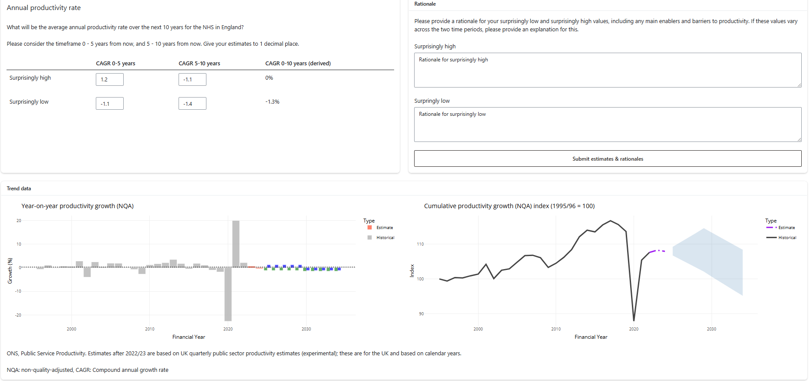
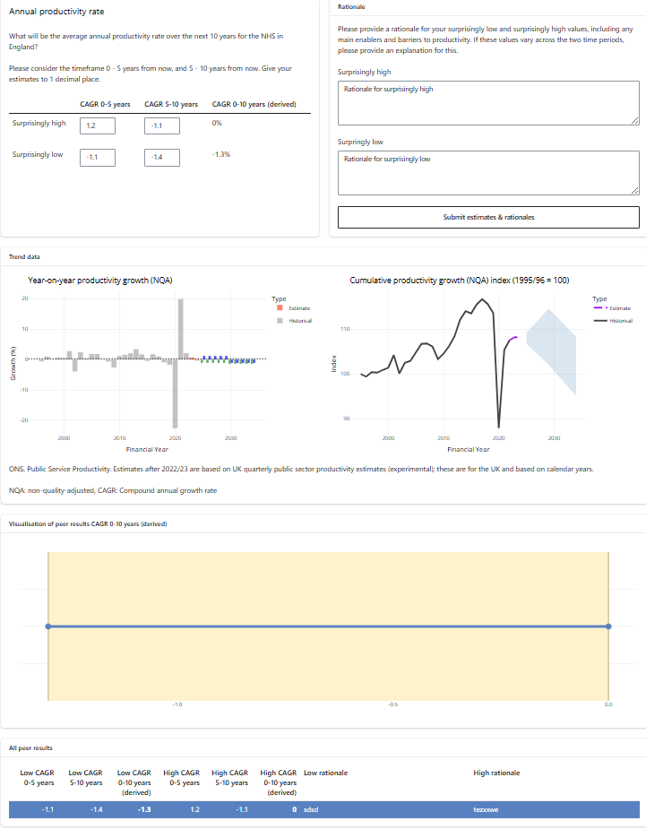

<!-- README.md is generated from README.Rmd. Please edit that file -->

# Productivity elicitation app (The Health Foundation)

This repo contains the shiny app code for an elicitation on Productivity
for The Health Foundation. The exercise was run in person at a workshop
on July 2025. Participants were split into three teams; research, policy
and front line.

The aggregation and analysis of the results, including presentions shown
during the workshop are on
[GitHub](https://github.com/The-Strategy-Unit/elicitation_thf_2025_07_results).

## Main changes from [core elicitation app](https://github.com/The-Strategy-Unit/nhp_elicitation_tool)

- Only one question was asked.
- The historic data was provided by The Health Foundation and graphs
  showing the trend.
- Four values were elicited, rather than 2. A p10 and p90 for the first
  5 years and a p10 and p90 for years 6 - 10. These were aggregtated
  into a p10 and p90 for the whole 10 year period.
- There were three “teams”. However, the results shown back in phase 2
  were the values of the entire group. Therefore there was only a single
  shiny app (and database) deployed.

## Screenshots

### Round 1

### Round 2

## Deployment

The script `deploy.R` can be used to redeploy to the production and
development environments.

The app is controlled by some environment variables that need to be set:

- `PHASE_1_END` should be the time and date when the first phase should
  end (in the form `YYYY-mm-dd HH:MM:SS` for the timezone
  `Europe/London`)
- `PHASE_2_END` should be as `PHASE_1_END`, but the time and date for
  when the second phase should end
- `PHASE_2_LIVE` should be set to a non-empty string to enable the
  second phase of the app: this allows the app to enter a “disabled”
  state at the end of phase 1
- `NHP_SALT` is a value that is used when encrypting the emails of users
- `save_path` should point to the location where to save the database
  to. If not set, then it defaults to the current working directory

## Development usage

The data required to run the app can be rebuilt using
`targets::tar_make()`. There are a few things that need to be set up in
order to get this to work.

1)  you will need to create a `.Renviron` file, with the following
    items:

- DB_SERVER=…
- DB_DATABASE=…
- NHP_SALT=…

2)  you will need to be connected to the MLCSU VPN and have access to
    the database.

3)  you will need a copy of the file `recruitment.xlsx`, stored in the
    root of the project folder.

